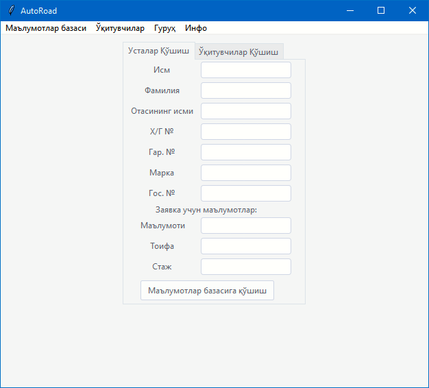
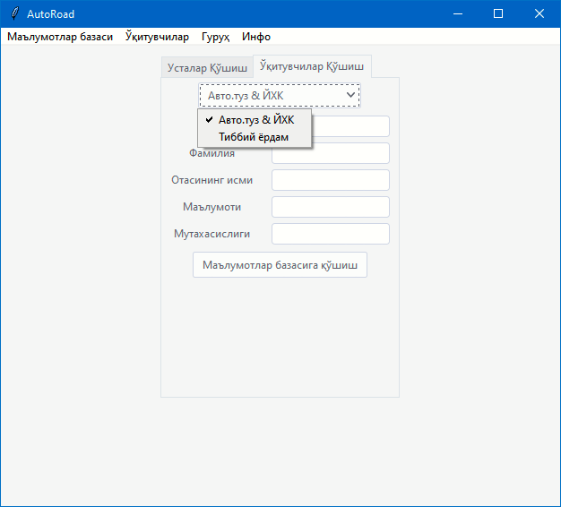
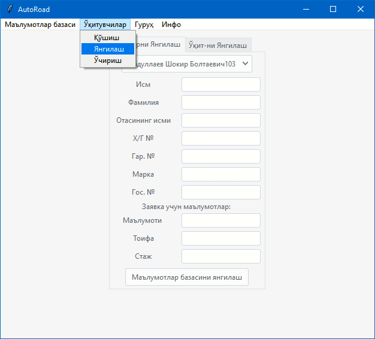
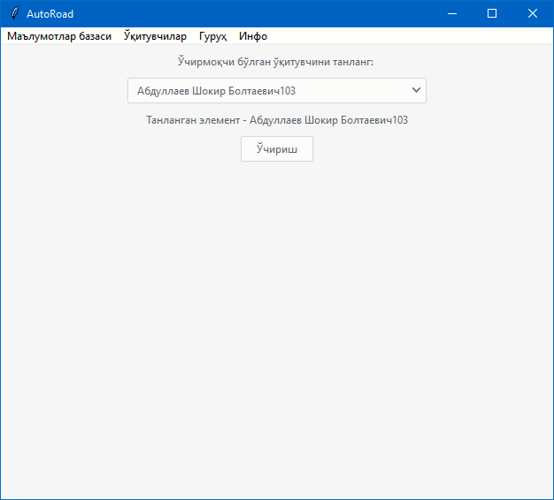
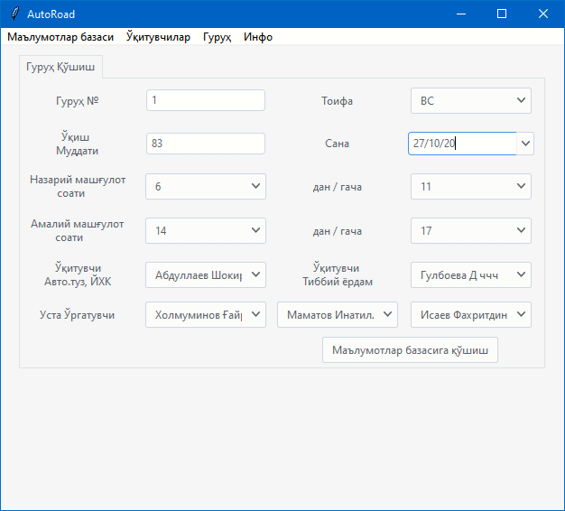
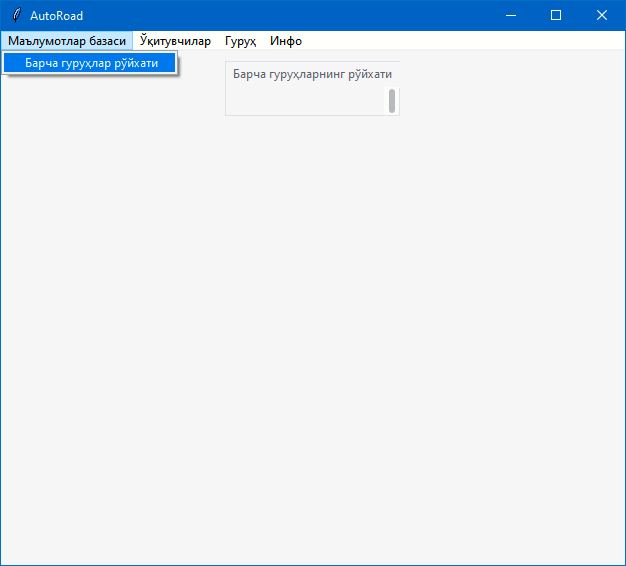

# Driving School App Projets 🚙
## During the project:
- Developed a desktop application for an organization to automate the papar work using Python & Tkinter & Xlwings. 
- Collaborated with `@Alimov-8` to create a GUI part and backend.  
- 21 days spent overall for project
- Learned how to connect excel database with Python Tkinter GUI. 
- Learned how to work in a team and manage a project

## Documentation 
- You can add/edit/delete teachers, drivers (instructors), and medical stuff. After adding you able to alter the info for each person.
- You can form a group, all the teaching stuff you have added will be visiable in this section
- After forming a group you can add students (max=20) for each group, you able to change/delete the info also
- Now everything was imported to excel file
- Excel files are being inherited from main `DataBase.xlsm` which was programmed in Visual Basic

## Screenshots
- 
- 
- 
- 
- 
- 
